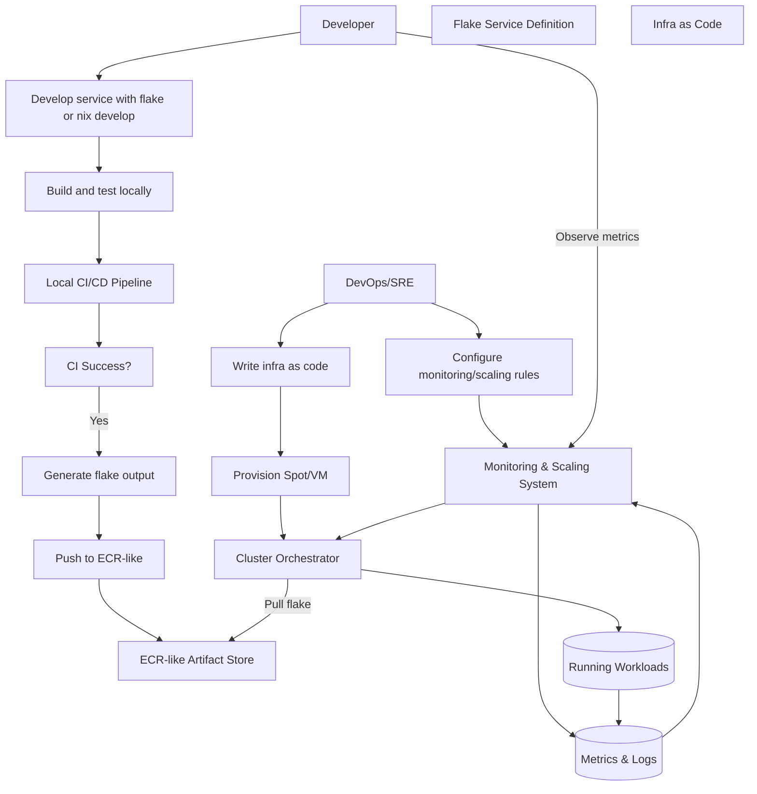

```mermaid
flowchart TD
  Dev[Developer]
  SRE[DevOps/SRE]
  Flake[Flake Service Definition]
  ECR[ECR-like Artifact Store]
  Infra[Infra as Code]
  CI[Local CI/CD Pipeline]
  Cluster[Cluster Orchestrator]
  Monitor[Monitoring & Scaling System]
  Logs[(Metrics & Logs)]
  Workloads[(Running Workloads)]

  %% Developer Flow
  Dev --> A1[Develop service with flake or nix develop]
  A1 --> A2[Build and test locally]
  A2 --> CI
  CI --> A3[CI Success?]
  A3 -->|Yes| A4[Generate flake output]
  A4 --> A5[Push to ECR-like]
  A5 --> ECR

  %% DevOps Flow
  SRE --> B1[Write infra as code]
  B1 --> B2[Provision Spot/VM]
  B2 --> Cluster
  SRE --> B3[Configure monitoring/scaling rules]
  B3 --> Monitor
  Monitor --> Cluster
  Monitor --> Logs

  %% Deployment Path
  Cluster -->|Pull flake| ECR
  Cluster --> Workloads
  Workloads --> Logs
  Logs --> Monitor

  %% Feedback Loop
  Dev -->|Observe metrics| Monitor

```
