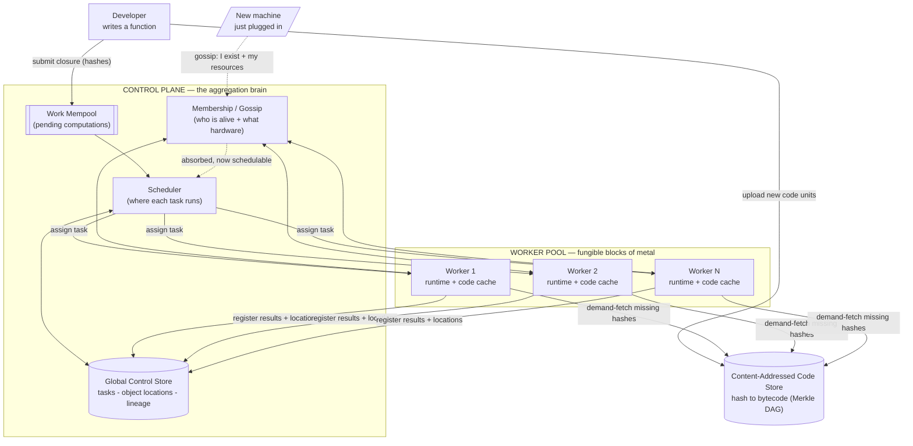
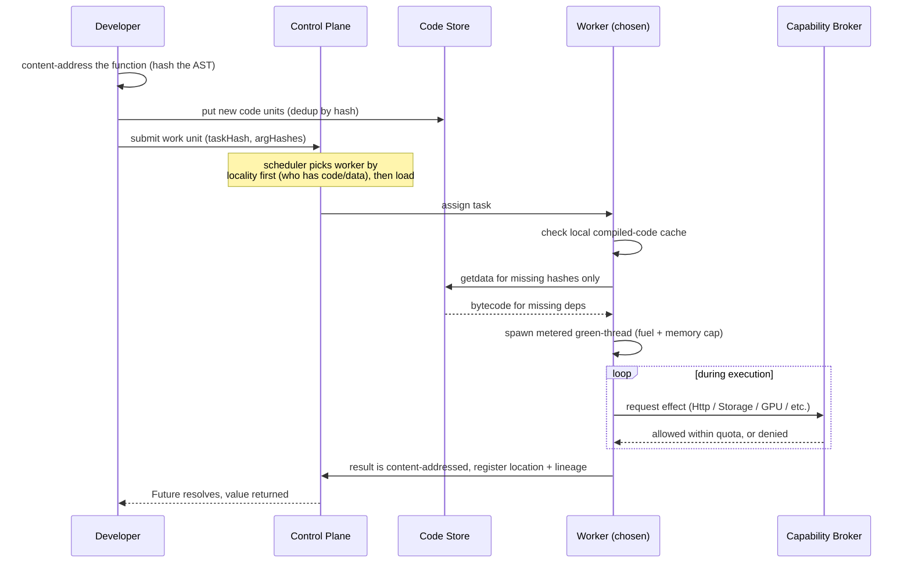
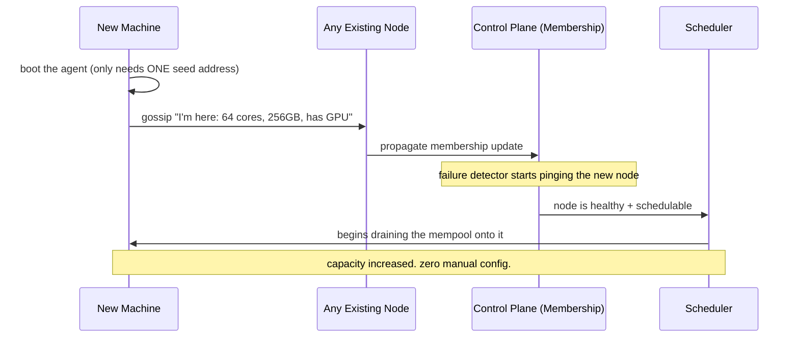
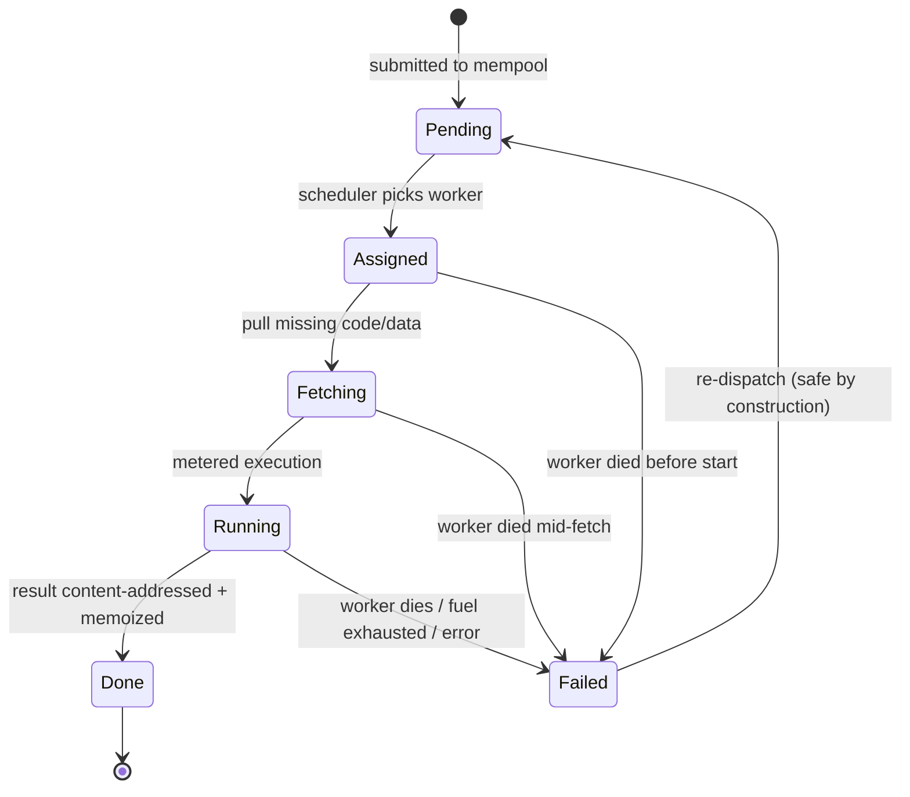

# l1ne

**A language and an inverse hypervisor — the next step in the evolution of computation.**

| | |
|---|---|
| **Name** | l1ne |
| **Version** | 0.1 — Draft |
| **Status** | Design and vision. Not yet implemented. |
| **What this is** | The design ideas behind l1ne, written to drive a POC and a deeper design process. |

---

## The bet: reinvent computation, don't repackage it

Computation has advanced by virtualizing whichever layer was underneath it, and each step raised the *unit of deployment* one level up:

- **Bare metal** — code runs directly on hardware. The unit is the machine. One workload per box, rigid and wasteful.
- **Virtual machines** — virtualize the *hardware*. Many operating systems on one machine. Far better utilization, but heavy: every VM hauls a full OS.
- **Containers** — virtualize the *operating system*. Share the kernel, package just the app and its dependencies. Lighter and faster — but they hand you a second job: orchestration, images, registries, networking, autoscaling. Kubernetes exists to manage the weight containers introduced.
- **Serverless / FaaS** — virtualize the *server abstraction*. "Just functions." But underneath it's still containers and microVMs, still cold starts, still deployment units and vendor lock. The abstraction says *function*; the machinery still says *ship a box*.

That is where we got stuck. The unit we actually want is the **function**, but to run one we still drag along the entire apparatus of boxing it up, scheduling the box, and isolating the box. Every layer for thirty years has been a smarter way to move a box around.

**l1ne proposes the next step: virtualize computation itself.** Don't package the function in a box and schedule the box. Make the *function* the thing that moves — addressed by what it *is* (a hash of its structure), executing directly on bare metal, with isolation coming from the **language** rather than from a box wrapped around it. The unit of deployment becomes a hash. A machine becomes a fungible block of compute. The pool becomes one computer.

---

## What l1ne is

l1ne is two things that only work because of each other.

**A language.** l1ne code is *content-addressed*: every definition is identified by a cryptographic hash of its structure, so identical code is the same hash everywhere and code can be moved and deduplicated for free. It is *effect-typed*: the only way code can touch the outside world — network, storage, clock, randomness, accelerators — is through a declared effect that a handler must grant. Its core evaluation is *pure and deterministic*, and *closures are serializable*, so a live computation can be shipped to another machine as nothing more than a hash plus its captured environment.

**An inverse hypervisor.** A hypervisor takes one machine and divides it into many virtual machines — multiplexing and isolating *downward*. l1ne does the inverse: it takes many machines and unifies them into one virtual computer — aggregating *upward*. It still provides the two things a hypervisor provides, just inverted:

- **Placement** becomes scheduling work across the whole pool, moving each computation to wherever its code and data already live.
- **Isolation** becomes the effect system plus resource metering (a CPU/fuel budget and a memory cap per task), instead of VM or container walls.

The link between the two halves is the whole point: **the language properties are exactly what make the inverse hypervisor possible.** Content-addressing is why moving computation is cheap and conflict-free. Effects are why a bare runtime can safely execute submitted code with no box around it. Determinism is why a failed computation can simply be re-run. Take away the language and you are back to shipping boxes; take away the runtime and the language is just a nice idea.

---

## What l1ne is not (v1)

Drawing the boundary is part of the design.

- **Not pooled memory.** v1 does not let a single computation use more RAM or cores than one physical machine has. That is distributed shared memory — a different and much harder system. l1ne's content-addressed model deliberately sidesteps it by favoring throughput: many computations across many cores, not one computation across many machines.
- **Not a defense against malicious code.** The trust model is an owned, trusted cluster. Isolation defends against *bugs* — runaway loops, memory blowups, accidental access — not against an attacker. Hardening against adversarial submitters or side channels is out of scope for v1.
- **Not decentralized.** No proof-of-work, fee markets, or Byzantine consensus. The control plane is centralized (replicated for availability). The Bitcoin-style mempool is borrowed only for how it *propagates* pending work, not for its economics.
- **Not container-compatible.** l1ne runs l1ne code, not arbitrary OS processes or container images.

---

## The architecture

The control plane is a thin coordinator, not a workhorse. It knows what hardware exists (membership), decides where work goes (scheduler), remembers everything (the Global Control Store), and holds the queue of pending work (the mempool). Real work happens on the workers, which are just runtime + cache and can be thrown away at any moment. The dotted path is the entire story for adding hardware — there is no other step.

---

## How a computation runs

Most function calls never leave the worker — they run in-process like lightweight green threads. Only computations marked remote (or that a cost heuristic decides are worth shipping) go through this whole dance. **Local by default, remote by policy.** This is what keeps l1ne out of the classic trap where every call is a slow network hop.

---

## How capacity grows

Because the membership message carries a resource descriptor (cores, RAM, accelerators, special instructions), this also handles *heterogeneous* hardware for free: GPU-requiring effects only schedule onto nodes that advertised a GPU. "Plug in more power" quietly becomes "plug in *any* power." Scaling l1ne is a physical act, not a configuration change.

---

## How it heals

Re-dispatch is *always safe* because a task is a pure function of its hashed inputs: re-running it either produces the identical result (dedupable by output hash) or was a no-op. Failure handling is therefore just "put it back in the mempool." The only things that can't be blindly re-run are genuine side effects — and those are funneled through the capability broker, which records each effect's result once so a replay reuses it instead of firing it again. The result, from the operator's chair: nodes die and nothing needs doing.

---

## Design decisions that define l1ne

**Local by default, remote by policy.** Ordinary calls run in-process; distribution happens only when annotated or when a cost/locality heuristic says it pays. This single decision is what separates a fast system from a latency swamp.

**Locality-first scheduling.** The primary placement signal is "where do the code and data already live," not "who is idle." Moving computation is cheap; moving data is not. The Global Control Store is what makes this possible — it knows where every cached object is.

**Stateless workers, content-addressed durable store.** No durable state lives in a worker; workers are pure cache and compute. Everything persistent lives in an addressed store and is cached near where it's used. This is the exact reason unplugging a machine breaks nothing.

**Heterogeneity-aware membership.** Every node advertises what it is; the scheduler matches work to capability. One pool can mix cheap CPU boxes, big-memory boxes, and GPU boxes.

**Self-healing is re-dispatch, not repair.** Determinism plus lineage in the control store means recovery is re-running, never patching. The system detects death and re-queues; no human is in the loop.

**Effects are the only escape hatch.** The non-negotiable invariant, and the foundation of the no-box safety story. If code physically cannot reach the outside world except by asking a broker, a bare runtime can safely execute it. This has to be built in from the first line; it cannot be retrofitted.

**Backpressure lives in the mempool.** When the pool is full, work queues. Plugging in hardware drains the queue faster. Throughput scales roughly linearly with the pool — which is the entire promise of the thing.

---

## What it feels like in practice

A developer writes a function and calls it. If it's marked remote, l1ne hashes it, ships any code the chosen worker doesn't already have, runs it under a metered green thread, routes its effects through a broker, and hands back the result. There were no images to build, no manifests to write, no service to deploy.

An operator wants more capacity, so they rack a machine, start the agent, and point it at any existing node. Seconds later it is taking work. No config file was edited and nothing else was restarted. To shrink the pool they mark a node draining; it finishes its work and is pulled with nothing lost.

A worker dies in the middle of a job. The failure detector notices within seconds, the control plane finds the tasks that were on it, and they reappear in the queue and run elsewhere. The developer sees a little extra latency and no error. Nobody is paged.

A large job fans out — a computation that recursively splits itself into subtasks — and those subtasks spread across every capable worker at once. Add machines while it runs and the queued subtasks immediately flow onto them, so the job simply finishes faster.

---

## Open forks

These are the genuine decisions and risks, stated honestly.

- **The runtime is the security boundary.** With no VM or container walls, a memory-safety bug in the interpreter — or especially a JIT — is a full escape. Keep the trusted runtime small and audited; prefer an interpreter or a verified JIT for the most sensitive tiers; keep cheap OS hardening (seccomp on the worker process) available as a backstop even though l1ne uses no containers.
- **Throughput vs pooled memory.** v1 commits to throughput. If a future need is "one computation larger than any machine," that is distributed shared memory and a substantially different design.
- **Centralized vs decentralized scheduling.** A single replicated control plane is simplest and fits the zero-touch goal; shard the control store as it grows. Go decentralized only once a single brain is the proven bottleneck.
- **Durable-store sharding and hot keys.** A single global store is easy to reason about but becomes a hot spot; plan for sharding and for popular-hash stampedes (seed hot code via gossip).
- **The network is the real ceiling.** Locality scheduling hides data movement; it does not repeal bandwidth limits. Treat the interconnect as part of the design, not an afterthought.

---

## Where to start: the POC

The POC proves the core loop end-to-end; it does **not** build the language yet. Keep everything minimal.

- **Language stand-in:** a minimal serializable closure format in a host language — just enough to hash a unit, store it, fetch it by hash, and evaluate it under a fuel counter.
- **Control plane:** one process holding an in-memory live set, a simple priority/FIFO mempool, and a trivial scheduler.
- **Workers:** two or three processes that register via a seed, accept a work unit, demand-fetch missing code by hash, evaluate under metering, route a single effect type (say `print` or `httpGet`) through a broker, and return a content-addressed result.
- **Storage:** an in-memory hash → bytes map for both code and results.

The POC has worked when all of these hold:

- **Run** — submit a function, it executes on a worker, the correct result returns.
- **Dedup** — submitting the same task again returns the memoized result with no re-execution.
- **Heal** — kill a worker mid-execution; the task re-dispatches automatically and the same result returns, with no manual action.
- **Scale** — start another worker pointed at a seed; it joins with no config and picks up queued work.
- **Meter** — a deliberately runaway task is killed by the fuel/memory limit with a typed error, without taking down the worker.
- **Broker** — a task requesting an ungranted effect is denied; a granted one succeeds and is recorded.

From there the throwaway parts get replaced deliberately: a real content-addressed language frontend, gossip membership with failure detection, locality-aware scheduling over a replicated control store, the full effect/capability system, content-addressed durable storage, and finally a JIT for hot code.
